I run **Variety Vault 3D**, a 3D printing and manufacturing shop in Ames, Iowa, and I write the software that runs it. Production parts, fixtures and ear tags on one side of the shop; AI agents, printer dashboards and trading tools on the other.

## What I build

| 🏭 Variety Vault 3D | 🤖 Shop automation | 📈 Trading tools |
|---|---|---|
| FDM, resin and SLS production: short runs, fixtures, replacement parts and custom work | A team of Claude and Codex agents across seven machines that take orders, quote jobs, watch the printers and keep the books | Order-flow indicators and strategies for NinjaTrader 8, written in C# |

## Toolbox

<b>Code</b>

<picture>
  <source media="(prefers-color-scheme: dark)" srcset="https://skillicons.dev/icons?i=py,rust,cs,dotnet,ts,nodejs,react,vite,tailwind,fastapi,postgres,cpp,arduino,raspberrypi,powershell,bash,cloudflare,githubactions,git,github,vscode,blender,linux,windows&perline=12&theme=dark">
  
</picture>

<b>Shop floor and business</b>

 

## Printed contributions

<picture>
  <source media="(prefers-color-scheme: dark)" srcset="assets/printed-contributions-dark.svg">
  
</picture>

<picture>
  <source media="(prefers-color-scheme: dark)" srcset="https://streak-stats.demolab.com/?user=jonboy648&theme=github-dark-blue&hide_border=true">
  
</picture>

## Open source

I'm releasing the tools behind this profile, starting with the printed-contributions graphic above. Pull requests I get merged into other projects land here automatically.

<!-- OPEN-SOURCE:START -->
- **printed-contributions**: a GitHub Action that draws your contribution year as a 3D print *(releasing soon)*
- First merged pull request to another project: coming up
<!-- OPEN-SOURCE:END -->

## Let's connect

I'm looking for people building in the same corners:

- 3D printing, small-batch manufacturing and print farms
- AI agents that run real operations, not demos
- Futures order flow and NinjaTrader tools

I'm also looking for good first issues in OrcaSlicer, Klipper and MCP servers. If your project needs a hand from someone who runs printers all day, point me at one.

If that's you, follow, open an issue to say hi, or find the shop at [vaultshop.us](https://www.vaultshop.us).

