<picture>
  <source media="(prefers-color-scheme: dark)" srcset="https://capsule-render.vercel.app/api?type=waving&color=0:6A5ACD%2C100:30D6C8&height=170&section=header&text=Jon%20Cackler&fontColor=ffffff&fontSize=40&animation=fadeIn&fontAlignY=36&desc=Variety%20Vault%203D%20%C2%B7%20custom%20tools%20%C2%B7%20an%20agent%20fleet%20that%20runs%20the%20shop&descAlignY=58&descSize=15">
  
</picture>

Ames, Iowa &middot; <a href="https://www.vaultshop.us">vaultshop.us</a> &middot; <a href="https://github.com/jonboy648/jonboy648/issues/new">say hi</a>

## A worldline, not a grid

Every GitHub profile draws the same 7&times;53 grid of squares. Below is a different projection of the same data: one continuous **worldline** through the last year, spiking on days with commits, the way a physicist would sketch a particle's path through spacetime instead of a spreadsheet of it. The brightest points are the busiest days. It's named after the physics it's plotting *and* after the repo at the bottom of this page.

<picture>
  <source media="(prefers-color-scheme: dark)" srcset="assets/worldline-dark.svg">
  
</picture>

Every number on that trace comes straight from the GitHub contribution calendar. Nothing staged, nothing sampled.

<picture>
  <source media="(prefers-color-scheme: dark)" srcset="https://streak-stats.demolab.com/?user=jonboy648&hide_border=true&background=00000000&ring=30D6C8&fire=6A5ACD&currStreakNum=E6EDF3&sideNums=30D6C8&currStreakLabel=30D6C8&sideLabels=9198A1&dates=9198A1&stroke=30363D">
  
</picture>

Want this line on your own profile? It's an open-source Action: **[jonboy648/worldlines](https://github.com/jonboy648/worldlines)**.

## What I actually build

I run **[Variety Vault 3D](https://www.vaultshop.us)** out of Ames, Iowa: production parts, fixtures and custom prints across a Bambu Lab X1C and H2D, Phrozen resin, and a Formlabs Fuse 1+ SLS. The shop is also the first customer for everything else here.

The thing I actually spend my time on is a small fleet of Claude and Codex agents, running across seven machines, that operate the shop: order intake, quoting, printer monitoring, the books. It's a distributed system that happens to have a 3D printer as one of its peripherals. I also build order-flow tools for NinjaTrader 8 in C#, and lately I've been down a tensor-network rabbit hole that has nothing to do with either.

  

## Event log

Four points along the worldline worth a closer look:

<table>
<tr>
<td width="50%" valign="top">

**[`printed-contributions`](https://github.com/jonboy648/printed-contributions)**
An open-source GitHub Action that draws your contribution year as a 3D print.

</td>
<td width="50%" valign="top">

**[`order-flow-bot`](https://github.com/jonboy648/order-flow-bot)**
A NinjaTrader order-flow bot, 96 commits deep. Where the trading side of this profile lives.

</td>
</tr>
<tr>
<td width="50%" valign="top">

**[`trust-me-bro`](https://github.com/jonboy648/trust-me-bro)**
A NinjaTrader add-on. *"Think Less. Trade Worse."* The name is the whole pitch.

</td>
<td width="50%" valign="top">

**[`quantum-worldline`](https://github.com/jonboy648/quantum-worldline)**
MERA / tensor-network research. The repo that lent this whole profile its physics.

</td>
</tr>
</table>

## Looking for collisions

- People building in **3D printing and manufacturing**
- **AI agents** running real operations, not demos
- **Futures order flow**: the market-microstructure kind, not the signals-service kind
- Good first issues in **OrcaSlicer**, **Klipper**, or **MCP servers**

If any of that is you, the worldline has room for another intersection &rarr; [open an issue and say hi](https://github.com/jonboy648/jonboy648/issues/new).

<a href="https://www.vaultshop.us">vaultshop.us</a>

